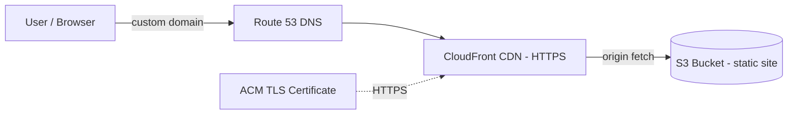

# Architecture — Static Website Hosting (S3, CloudFront & Route 53)

A static website served securely and globally: content is stored in S3, delivered via the CloudFront CDN with HTTPS, and reached through a custom domain in Route 53.

## How it works

- Route 53 resolves the custom domain to the CloudFront distribution.
- CloudFront caches content at edge locations for low latency and serves it over HTTPS.
- The S3 bucket is the origin holding the static website files (private, accessed via CloudFront).
- An ACM certificate provides TLS so the site is served securely over HTTPS.
